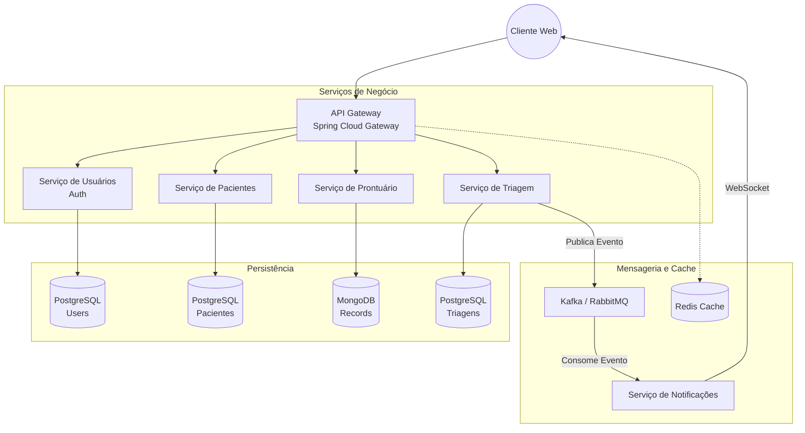

```mermaid
flowchart TD
    Client((Cliente Web)) --> Gateway[API Gateway\nSpring Cloud Gateway]
    
    subgraph Serviços de Negócio
        Gateway --> Auth[Serviço de Usuários\nAuth]
        Gateway --> Pacientes[Serviço de Pacientes]
        Gateway --> Prontuario[Serviço de Prontuário]
        Gateway --> Triagem[Serviço de Triagem]
    end
    
    subgraph Mensageria e Cache
        Triagem -- Publica Evento --> Kafka[Kafka / RabbitMQ]
        Kafka -- Consome Evento --> Notificacoes[Serviço de Notificações]
        Gateway -.-> Redis[(Redis Cache)]
    end
    
    subgraph Persistência
        Auth --> DB_User[(PostgreSQL\nUsers)]
        Pacientes --> DB_Pac[(PostgreSQL\nPacientes)]
        Prontuario --> DB_Pront[(MongoDB\nRecords)]
        Triagem --> DB_Tria[(PostgreSQL\nTriagens)]
    end
    
    Notificacoes -- WebSocket --> Client
```