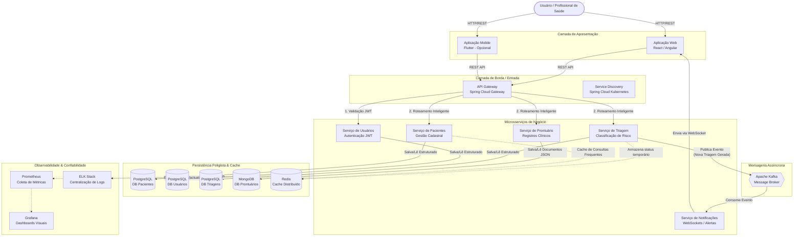

```mermaid
flowchart TB
    %% Atores
    User([Usuário / Profissional de Saúde])
    
    %% Camada de Apresentação
    subgraph Frontend [Camada de Apresentação]
        WebApp[Aplicação Web\nReact / Angular]
        MobileApp[Aplicação Mobile\nFlutter - Opcional]
    end

    %% Camada de Borda / Entrada
    subgraph Edge [Camada de Borda / Entrada]
        APIGateway[API Gateway\nSpring Cloud Gateway]
        ServiceDiscovery[Service Discovery\nSpring Cloud Kubernetes]
    end

    %% Camada de Serviços
    subgraph Core [Microsserviços de Negócio]
        AuthSvc[Serviço de Usuários\nAutenticação JWT]
        PatSvc[Serviço de Pacientes\nGestão Cadastral]
        RecSvc[Serviço de Prontuário\nRegistros Clínicos]
        TriSvc[Serviço de Triagem\nClassificação de Risco]
        NotifSvc[Serviço de Notificações\nWebSockets / Alertas]
    end

    %% Camada de Dados
    subgraph Data [Persistência Poliglota & Cache]
        PG_Pat[(PostgreSQL\nDB Pacientes)]
        PG_Auth[(PostgreSQL\nDB Usuários)]
        PG_Tri[(PostgreSQL\nDB Triagens)]
        Mongo_Rec[(MongoDB\nDB Prontuários)]
        Redis[(Redis\nCache Distribuído)]
    end

    %% Camada de Eventos
    subgraph Messaging [Mensageria Assíncrona]
        Kafka{{Apache Kafka\nMessage Broker}}
    end

    %% Observabilidade
    subgraph Observability [Observabilidade & Confiabilidade]
        Prometheus[Prometheus\nColeta de Métricas]
        Grafana[Grafana\nDashboards Visuais]
        ELK[ELK Stack\nCentralização de Logs]
    end

    %% Relacionamentos e Fluxos
    User -->|HTTP/REST| WebApp
    User -->|HTTP/REST| MobileApp
    
    WebApp -->|REST API| APIGateway
    MobileApp -->|REST API| APIGateway
    
    APIGateway -->|1. Validação JWT| AuthSvc
    
    APIGateway -->|2. Roteamento Inteligente| PatSvc
    APIGateway -->|2. Roteamento Inteligente| RecSvc
    APIGateway -->|2. Roteamento Inteligente| TriSvc
    
    PatSvc -->|Salva/Lê Estruturado| PG_Pat
    AuthSvc -->|Salva/Lê Estruturado| PG_Auth
    TriSvc -->|Salva/Lê Estruturado| PG_Tri
    RecSvc -->|Salva/Lê Documentos JSON| Mongo_Rec
    
    TriSvc -.->|Armazena status temporário| Redis
    PatSvc -.->|Cache de Consultas Frequentes| Redis
    
    TriSvc -- Publica Evento\n(Nova Triagem Gerada) --> Kafka
    Kafka -- Consome Evento --> NotifSvc
    
    NotifSvc -- Envia via WebSocket --> WebApp
    
    %% Ligações de Observabilidade
    Core -.->|Expõe Métricas /actuator| Prometheus
    Prometheus -.-> Grafana
    Core -.->|Stream de Logs| ELK
```