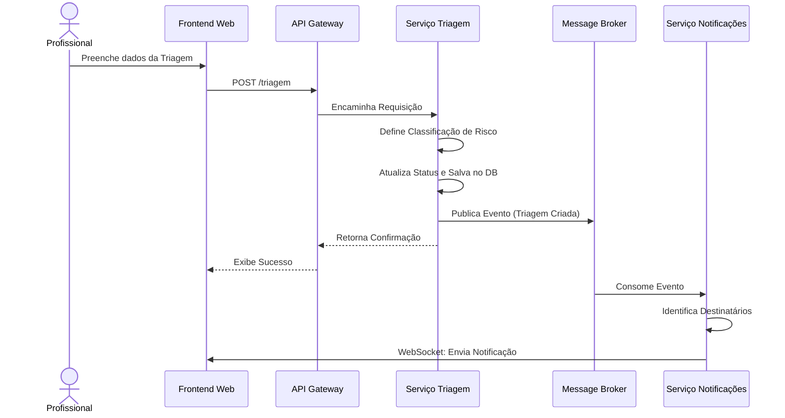

```mermaid
sequenceDiagram
    actor Profissional
    participant Web as Frontend Web
    participant GW as API Gateway
    participant ST as Serviço Triagem
    participant Kafka as Message Broker
    participant SN as Serviço Notificações

    Profissional->>Web: Preenche dados da Triagem
    Web->>GW: POST /triagem
    GW->>ST: Encaminha Requisição
    ST->>ST: Define Classificação de Risco
    ST->>ST: Atualiza Status e Salva no DB
    ST->>Kafka: Publica Evento (Triagem Criada)
    ST-->>GW: Retorna Confirmação
    GW-->>Web: Exibe Sucesso
    
    Kafka->>SN: Consome Evento
    SN->>SN: Identifica Destinatários
    SN->>Web: WebSocket: Envia Notificação
```