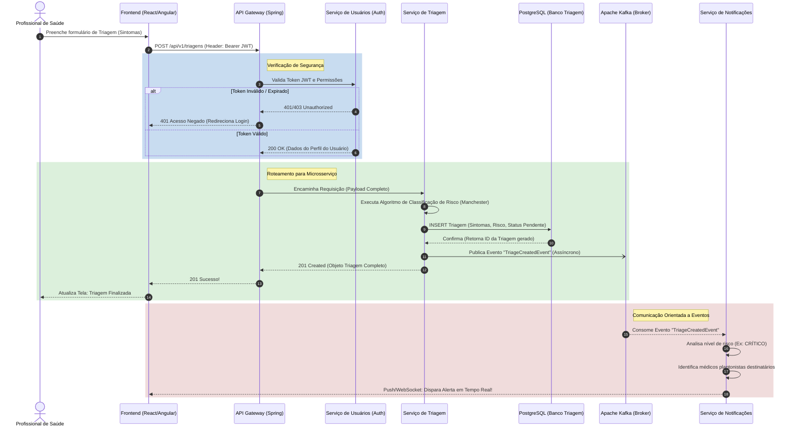

```mermaid
sequenceDiagram
    autonumber
    actor Medico as Profissional de Saúde
    participant Front as Frontend (React/Angular)
    participant API as API Gateway (Spring)
    participant Auth as Serviço de Usuários (Auth)
    participant Triage as Serviço de Triagem
    participant DB as PostgreSQL (Banco Triagem)
    participant Kafka as Apache Kafka (Broker)
    participant Notif as Serviço de Notificações
    
    Medico->>Front: Preenche formulário de Triagem (Sintomas)
    Front->>API: POST /api/v1/triagens (Header: Bearer JWT)
    
    %% Autenticação e Autorização no Gateway
    rect rgb(200, 220, 240)
        Note right of API: Verificação de Segurança
        API->>Auth: Valida Token JWT e Permissões
        alt Token Inválido / Expirado
            Auth-->>API: 401/403 Unauthorized
            API-->>Front: 401 Acesso Negado (Redireciona Login)
        else Token Válido
            Auth-->>API: 200 OK (Dados do Perfil do Usuário)
        end
    end
        
    %% Fluxo Principal com Circuit Breaker Implícito
    rect rgb(220, 240, 220)
        Note right of API: Roteamento para Microsserviço
        API->>Triage: Encaminha Requisição (Payload Completo)
        
        Triage->>Triage: Executa Algoritmo de Classificação de Risco (Manchester)
        
        Triage->>DB: INSERT Triagem (Sintomas, Risco, Status Pendente)
        DB-->>Triage: Confirma (Retorna ID da Triagem gerado)
        
        %% Assíncrono Mensageria
        Triage-)Kafka: Publica Evento "TriageCreatedEvent" (Assíncrono)
        
        Triage-->>API: 201 Created (Objeto Triagem Completo)
        API-->>Front: 201 Sucesso!
        Front-->>Medico: Atualiza Tela: Triagem Finalizada
    end
        
    %% Consumo de Evento
    rect rgb(240, 220, 220)
        Note right of Kafka: Comunicação Orientada a Eventos
        Kafka-->>Notif: Consome Evento "TriageCreatedEvent"
        Notif->>Notif: Analisa nível de risco (Ex: CRÍTICO)
        Notif->>Notif: Identifica médicos plantonistas destinatários
        Notif-->>Front: Push/WebSocket: Dispara Alerta em Tempo Real!
    end
```