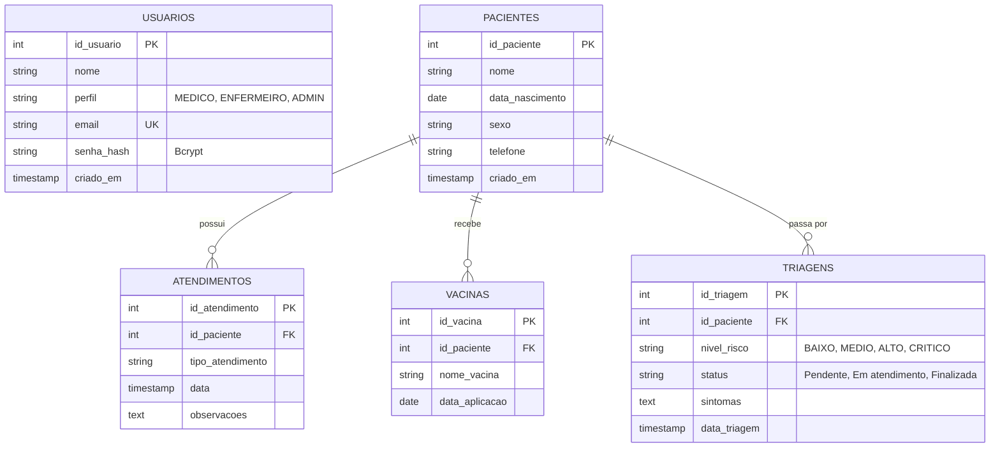
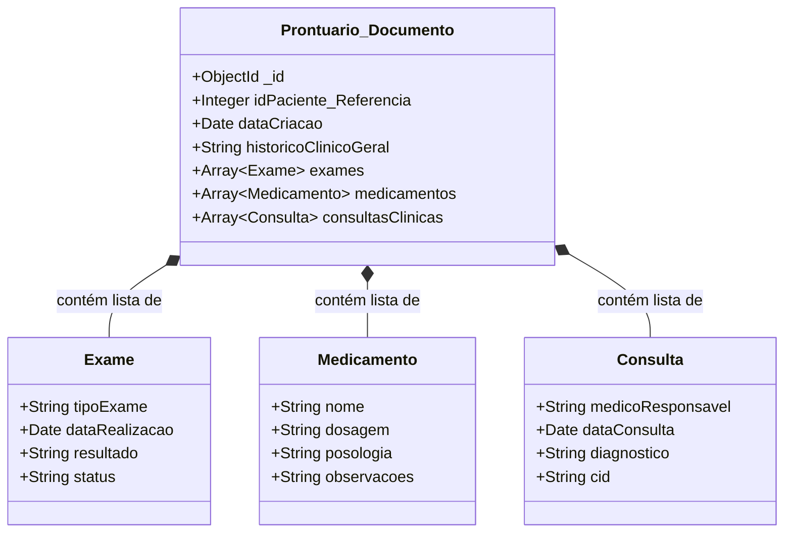

### 1. Entidades Relacionais (PostgreSQL)
Este diagrama reflete os dados altamente estruturados gerenciados pelos microsserviços de **Usuários**, **Pacientes** e **Triagem**.

---

### 2. Entidades Orientadas a Documentos (MongoDB)
Este diagrama reflete a estrutura flexível JSON (NoSQL) gerenciada pelo microsserviço de **Prontuários Eletrônicos**, onde um único "Documento de Prontuário" pode conter infinitos subarrays (exames, consultas, medicamentos) sem a necessidade de _Joins_ complexos.

