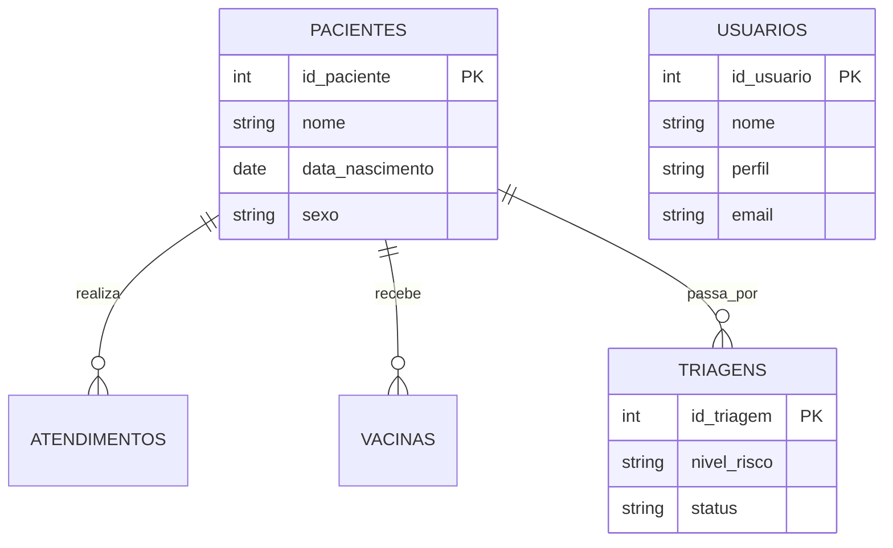

```mermaid
erDiagram
    PACIENTES ||--o{ ATENDIMENTOS : realiza
    PACIENTES ||--o{ VACINAS : recebe
    PACIENTES ||--o{ TRIAGENS : passa_por
    USUARIOS {
        int id_usuario PK
        string nome
        string perfil
        string email
    }
    PACIENTES {
        int id_paciente PK
        string nome
        date data_nascimento
        string sexo
    }
    TRIAGENS {
        int id_triagem PK
        string nivel_risco
        string status
    }
```